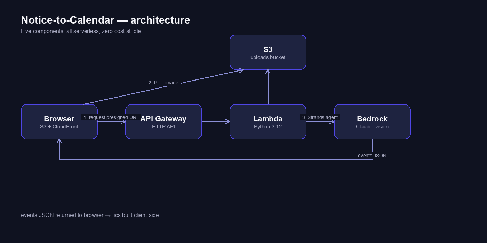

# Notice-to-Calendar

Drop a photo of a college notice. Get back a `.ics` file with every deadline in it.

Built for the **Bharat Builds Tour — First Commit hackathon** (Ship It track), Sept 17–20 2026.

## Live URL

_TBD — filled in once deployed._

## The problem

College notices circulate as photos in WhatsApp groups. Deadlines sit inside images, never
reach anyone's calendar, and get missed. This closes that gap: upload the photo, get the
deadlines as calendar events.

## Architecture



```
Browser (S3 + CloudFront)
  -> API Gateway (HTTP API)
    -> Lambda (Python 3.12)
      -> S3 presigned PUT (image upload)
      -> Bedrock (Claude, vision) via a Strands Agent
  <- events JSON
Browser builds the .ics client-side and downloads it.
```

Five components, all serverless, zero cost at idle:

| Component | Choice | Why |
|---|---|---|
| Frontend | S3 static site behind CloudFront | The live URL, no server to run |
| API | API Gateway HTTP API | Cheaper and simpler than REST API |
| Compute | Lambda, Python 3.12 | Two routes, one function |
| Agent | Strands Agents SDK | The AWS open-source proof point |
| Model | Bedrock, Claude (vision) | Reads the image directly, no OCR layer |
| Upload | S3 presigned PUT | Phone photos exceed API Gateway's 6MB body limit |

### Cost, per 1,000 notices

- Lambda: ~1,000 invocations at ~3s / 512MB — a few cents
- API Gateway HTTP API: ~$0.001 per 1,000 requests
- S3 + CloudFront: negligible at this volume
- Bedrock: the dominant cost, driven by image input tokens

Idle cost is zero.

## Local setup

```bash
# backend
cd backend
pip install -r requirements.txt -t .

# confirm Bedrock model access first (single hard blocker)
aws bedrock-runtime invoke-model --region <region> --model-id <model-id> \
  --body '{"anthropic_version":"bedrock-2023-05-31","max_tokens":10,"messages":[{"role":"user","content":"hi"}]}' \
  --cli-binary-format raw-in-base64-out out.json && cat out.json

# deploy
cd ..
sam build && sam deploy --guided

# frontend
aws s3 sync frontend/ s3://<site-bucket> --delete
aws cloudfront create-invalidation --distribution-id <id> --paths "/*"
```

## AI tools used

- **Claude Code** (Anthropic) — planning and implementation of the entire codebase (backend, frontend, infra).
- **Claude on Bedrock** (Anthropic, via Strands Agents SDK) — the notice-extraction model at runtime.

## Credits

Sample notice images in `samples/` are synthetic stand-ins (generated, not photographed) —
real WhatsApp notice photos weren't available in this build environment. They mimic the
formatting quirks a real notice has: day-first dates, a reference number that is not an
event, and several dated items in one notice. Used for prompt development and testing only.

## Known trade-offs (deliberate)

- Uploaded images are never deleted (beyond a 1-day S3 lifecycle rule).
- No rate limiting; the API is open (no auth).
- No database — nothing is persisted beyond the S3 lifecycle window.

These are named deliberately, not oversights — out of scope for a Ship It hackathon build.
